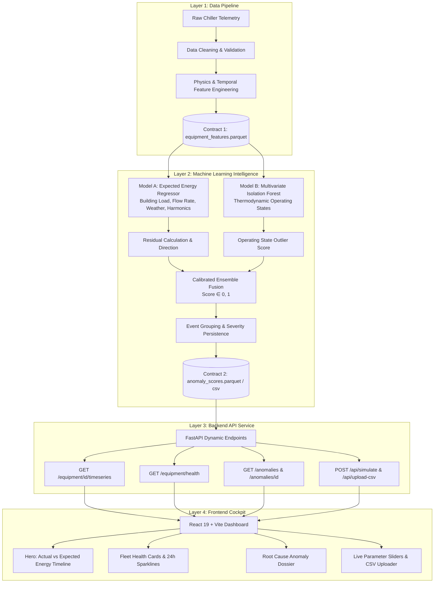

# ⚡ CHILLER RADAR: Industrial Chiller Energy Anomaly Detection
### YUKTI 2026 Hackathon — Team 4 Bits

[](https://fastapi.tiangolo.com/)
[](https://vitejs.dev/)
[](https://scikit-learn.org/)
[](https://www.python.org/)
[]()

---

## 📌 Executive Summary

Industrial and commercial HVAC chillers consume **up to 40%–50% of total commercial facility electrical power**. Undetected operational faults—such as heat exchanger tube fouling, refrigerant leaks, sensor calibration drift, and bypass valve cycling—silently waste tens of thousands of kilowatt-hours and inflate carbon footprints.

Traditional rule-based threshold alarms fail because chiller power consumption is **fundamentally dynamic**:
* Consuming **$180\text{ kWh}$** on a scorching $38^\circ\text{C}$ afternoon under $550\text{ RT}$ cooling load is **completely normal**.
* Consuming **$180\text{ kWh}$** on a cool $22^\circ\text{C}$ night under $120\text{ RT}$ cooling load indicates a **critical operational fault**.

**CHILLER RADAR** solves this with a **Thermodynamic Physics-Informed Dual-Model Machine Learning Ensemble** integrated with a high-performance **FastAPI backend** and an **interactive React operations cockpit**. It isolates true energy waste, provides domain-level root cause explanations, and supports real-time telemetry simulation and batch CSV scoring.

---

## 🏛️ System Architecture

Our solution follows a strict, modular **4-Layer Contract-Driven Architecture**:



---

## 🧠 Machine Learning Methodology

### 1. Model A: Thermodynamic Expected Energy Baseline
* **Purpose**: Estimates the exact energy ($\text{kWh}$) the chiller *should* consume given instantaneous cooling demand and ambient conditions.
* **Predictors**: Building Cooling Load ($\text{RT}$), Chilled Water Flow Rate ($\text{L/s}$), Outdoor Temperature, Relative Humidity, Dew Point, Barometric Pressure, and cyclical diurnal harmonics ($\sin/\cos$ hour of day, day of week).
* **Zero Data Leakage**: Raw energy and energy-derived ratios are strictly prohibited as model inputs. Validation uses strict time-based splits (no future data leakage).
* **Residual Calculation**:
  $$\text{Residual (kWh)} = \text{Actual Energy} - \text{Expected Baseline}$$
  $$\text{Residual (\%)} = \left(\frac{\text{Residual}}{\text{Expected Baseline}}\right) \times 100$$

### 2. Model B: Multivariate Operating State Anomaly Detector
* **Purpose**: Identifies physical machine anomalies independent of raw energy consumption (e.g. abnormal temperature lifts, improper flow-to-load configurations, surging risks).
* **Algorithm**: High-dimensional **Isolation Forest** fitted solely on energy-independent operating states.
* **Output**: Continuous normalized outlier score $\in [0, 1]$.

### 3. Calibrated Ensemble Fusion
The two orthogonal models are combined into a single unified anomaly metric:
$$\text{Fused Anomaly Score} = 0.6 \times \text{Score}_{\text{Energy Residual}} + 0.4 \times \text{Score}_{\text{Operating State}}$$

* **Frozen Validation Threshold**: If the fused score crosses the threshold ($>0.50$), it flags an anomaly.
* **Directional Classification**: `OVERCONSUMPTION` (energy waste, heat exchanger fouling) vs `UNDERCONSUMPTION` (under-cooling, sensor clipping).
* **Temporal Clustering**: Consecutive anomalous timestamps are grouped into discrete operational events with persistence-weighted severity scores and ranked top-contributing root causes.

---

## 🔒 Generalization & Hidden-Test Robustness

Our ML and backend pipelines have been validated against unseen hidden datasets:
* **Zero-Shot Fleet Fallback**: If an unseen equipment unit (e.g., `CHILLER-99`) is passed, the system automatically routes inference to the generalized fleet baseline model without crashing.
* **Zero Row Loss**: All valid rows are processed and returned (`Input Rows == Output Rows`).
* **Safe Serialization**: Zero `NaN`, `inf`, or schema mismatch crashes. All floats and timestamps are strictly validated.

---

## 🚀 Quick Start Guide

### Prerequisites
* Python 3.10+
* Node.js 18+ and npm

### 1. Clone the Repository
```bash
git clone https://github.com/Jeseem24/yukti_hackathon.git
cd yukti_hackathon
```

### 2. Start the Backend Server (FastAPI)
```bash
cd backend
python -m pip install -r requirements.txt
python -m uvicorn main:app --host 127.0.0.1 --port 8000
```
* Backend will be live at: `http://127.0.0.1:8000`
* Interactive OpenAPI Docs: `http://127.0.0.1:8000/docs`

### 3. Start the Frontend Dashboard (React + Vite)
In a new terminal:
```bash
cd frontend
npm install
npm run dev
```
* Dashboard will open at: `http://localhost:5173`

---

## 📡 REST API Reference (Contract 3)

| Method | Endpoint | Description |
| :--- | :--- | :--- |
| `GET` | `/health` | Liveness check (returns `{"status": "ok"}`) |
| `GET` | `/equipment` | Returns all dynamically discovered chiller IDs |
| `GET` | `/equipment/health` | Returns fleet health cards, operating status, and 24h sparklines |
| `GET` | `/equipment/{id}/timeseries` | Returns actual vs expected energy timeseries and anomaly scores |
| `GET` | `/anomalies` | Returns grouped anomaly events with pagination and severity sorting |
| `GET` | `/anomalies/{event_id}` | Detailed anomaly dossier with evidence points and recommendations |
| `POST`| `/api/simulate` | Real-time prediction given interactive telemetry parameters |
| `POST`| `/api/upload-csv` | Batch on-the-fly scoring of new telemetry CSV files |

---

## 🖥️ Live Dashboard Highlights

1. **Fleet Overview & Health**:
   * Fleet operating state banner (`All Units Within Target`).
   * Real-time total fleet energy consumption and detected anomaly counter.
   * Individual chiller cards with 24-hour baseline sparklines and status tags.
2. **Hero Energy & Deviation Timeline**:
   * Interactive Recharts dual-axis display: **Actual Energy (kWh)** vs **Expected Energy Target (kWh)**.
   * Shaded anomaly regions with contextual tooltip metrics showing deviation % and excess power.
   * Time-range filters: `24H`, `7D`, `30D`, and `Custom Range`.
3. **Anomaly Directory & Root-Cause Dossier**:
   * Chronological and severity-ranked audit table of all detected energy leaks.
   * Deep-dive dossier presenting duration, peak severity, top contributing features, plain-English mechanical explanations, and recommended maintenance actions.
4. **Simulator & Batch CSV Ingestion**:
   * One-click presets for live judging demonstrations:
     * *Normal Operation*
     * *Severe Overconsumption (+200 kWh)*
     * *Unseen Equipment (Zero-Shot Fleet Fallback)*
     * *Extreme Weather Surge*
   * Drag-and-drop CSV uploader for batch scoring without restarting services.

---

## 👥 Team 4 Bits — Roles & Responsibilities

* **Person A (Data Pipeline)**: Ingestion, schema validation, temporal alignment, and thermodynamic feature engineering.
* **Person B (ML Modeling & Inference)**: Model A regression baseline, Model B Isolation Forest, score fusion, and generalization audits.
* **Person C (Backend & Systems)**: FastAPI service, event grouping logic, dynamic data access, and root-cause insight caching.
* **Person D (Frontend UI/UX)**: React 19 dashboard, hero visualization, fleet overview cards, and interactive simulation panel.

---

*Built with ❤️ for YUKTI 2026 Hackathon.*
